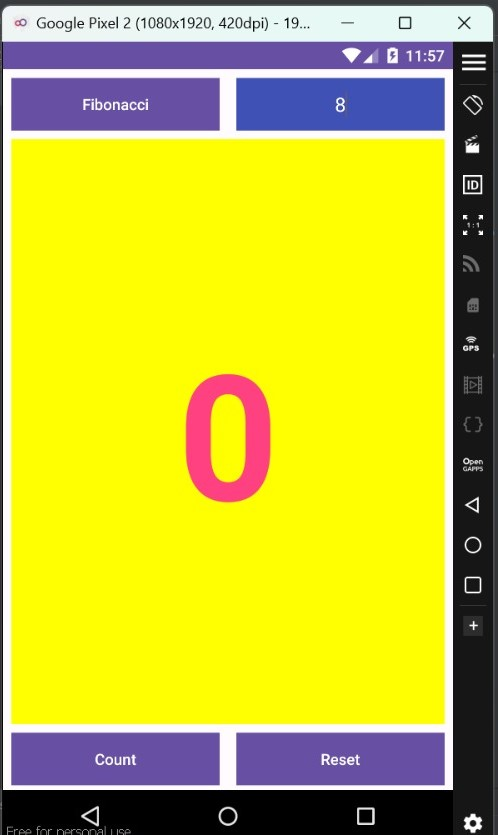
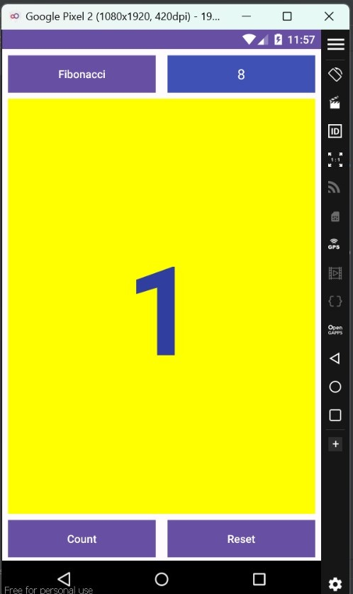
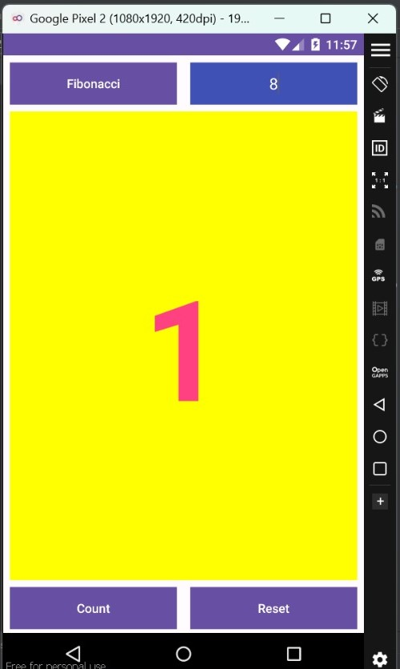
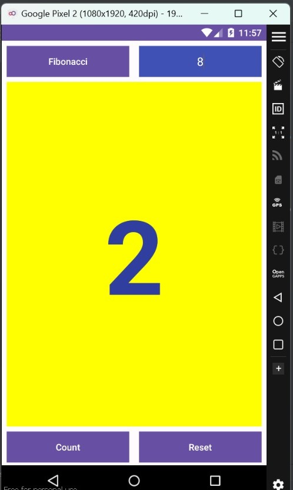
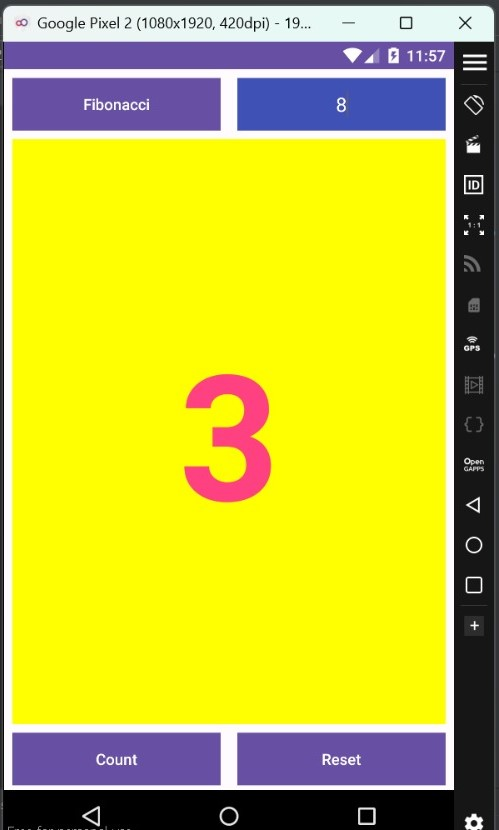
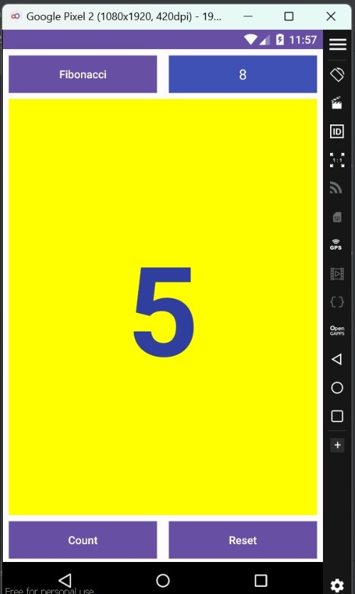
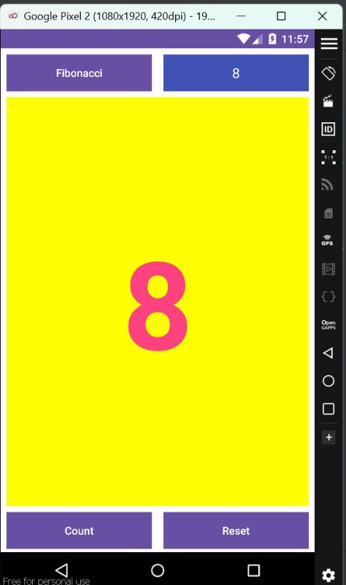
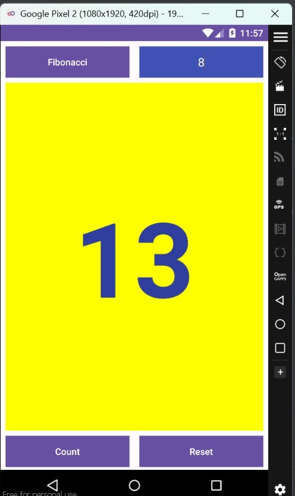
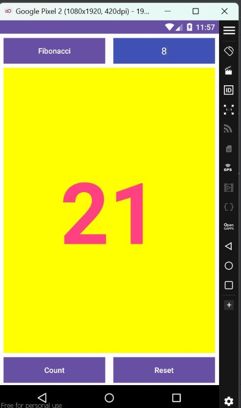
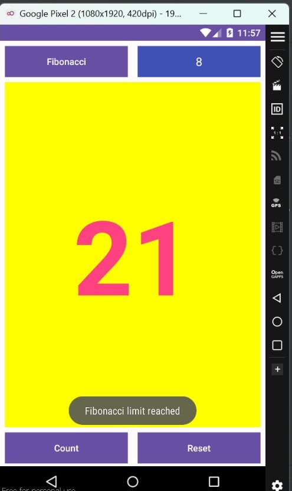

# HelloAppsTI22A4

`Nama   : Faizah Via Fadhillah`

`NIM    : 312210460`

`Kelas  : TI.22.A.4`

`Matkul : Pemrograman Mobile 1`


# Fibonacci Application

## Activity_toast.xml


```xml
<?xml version="1.0" encoding="utf-8"?>
<androidx.constraintlayout.widget.ConstraintLayout
    xmlns:android="http://schemas.android.com/apk/res/android"
    xmlns:app="http://schemas.android.com/apk/res-auto"
    xmlns:tools="http://schemas.android.com/tools"
    android:layout_width="match_parent"
    android:layout_height="match_parent"
    tools:context=".MainActivity">


    <Button
        android:id="@+id/button_fibonacci"
        android:layout_width="190dp"
        android:layout_height="48dp"
        android:layout_marginEnd="8dp"
        android:layout_marginStart="8dp"
        android:layout_marginTop="8dp"
        android:background="@color/colorPrimary"
        android:onClick="showFibonacci"
        android:text="@string/button_label_fibonacci"
        android:textColor="@android:color/white"
        app:layout_constraintEnd_toEndOf="parent"
        app:layout_constraintStart_toStartOf="parent"
        app:layout_constraintHorizontal_bias="0.0"
        app:layout_constraintTop_toTopOf="parent"
        tools:ignore="OnClick" />

    <EditText
        android:id="@+id/limit_input"
        android:layout_width="190dp"
        android:layout_height="48dp"
        android:layout_marginStart="8dp"
        android:layout_marginTop="8dp"
        android:layout_marginEnd="8dp"
        android:background="@color/colorPrimary"
        android:textAlignment="center"
        android:textColor="@color/white"
        android:hint="Enter limit"
        android:textColorHint="@color/white"
        android:inputType="number"
        app:layout_constraintEnd_toEndOf="parent"
        app:layout_constraintHorizontal_bias="1.0"
        app:layout_constraintStart_toStartOf="parent"
        app:layout_constraintTop_toTopOf="parent" />

    <Button
        android:id="@+id/button_count"
        android:layout_width="190dp"
        android:layout_height="wrap_content"
        android:layout_marginStart="8dp"
        android:layout_marginEnd="8dp"
        android:layout_marginBottom="4dp"
        android:background="@color/colorPrimary"
        android:onClick="countUp"
        android:text="@string/button_label_count"
        android:textColor="@android:color/white"
        app:layout_constraintBottom_toBottomOf="parent"
        app:layout_constraintEnd_toEndOf="parent"
        app:layout_constraintHorizontal_bias="0.0"
        app:layout_constraintStart_toStartOf="parent" />

    <Button
        android:id="@+id/button_reset"
        android:layout_width="190dp"
        android:layout_height="wrap_content"
        android:layout_marginStart="8dp"
        android:layout_marginEnd="8dp"
        android:layout_marginBottom="4dp"
        android:background="@color/colorPrimary"
        android:onClick="reset"
        android:text="Reset"
        android:textColor="@android:color/white"
        app:layout_constraintBottom_toBottomOf="parent"
        app:layout_constraintEnd_toEndOf="parent"
        app:layout_constraintHorizontal_bias="1.0"
        app:layout_constraintStart_toStartOf="parent"
        tools:ignore="OnClick" />

    <TextView
        android:id="@+id/show_count"
        android:layout_width="0dp"
        android:layout_height="0dp"
        android:layout_marginStart="8dp"
        android:layout_marginTop="8dp"
        android:layout_marginEnd="8dp"
        android:layout_marginBottom="8dp"
        android:background="#FFFF00"
        android:gravity="center_vertical"
        android:text="0"
        android:textAlignment="center"
        android:textColor="@color/colorPrimary"
        android:textSize="160sp"
        android:textStyle="bold"
        app:layout_constraintBottom_toTopOf="@+id/button_count"
        app:layout_constraintEnd_toEndOf="parent"
        app:layout_constraintHorizontal_bias="0.0"
        app:layout_constraintStart_toStartOf="parent"
        app:layout_constraintTop_toBottomOf="@+id/button_fibonacci"
        app:layout_constraintVertical_bias="0.0"
        tools:ignore="RtlCompat" />


</androidx.constraintlayout.widget.ConstraintLayout>
```


## MainActivity.java


```java
package com.helloappsti22a4;

import androidx.appcompat.app.AppCompatActivity;
import androidx.core.content.ContextCompat;

import android.os.Bundle;
import android.widget.TextView;
import android.view.View;
import android.widget.Toast;
import android.widget.EditText;

import androidx.appcompat.app.AppCompatActivity;
import androidx.core.content.ContextCompat;

import android.os.Bundle;
import android.widget.TextView;
import android.view.View;
import android.widget.Toast;
import android.widget.EditText;

public class MainActivity extends AppCompatActivity {

    private long fibMinus1 = 0;
    private long fibMinus2 = 1;
    private long currentFib = 0;
    private TextView mShowFibonacci;
    private long i = 0;

    private long n = 0;
    private long limit = 0; // Menyimpan batas Fibonacci yang diinginkan

    private EditText mLimitInput;

    @Override
    protected void onCreate(Bundle savedInstanceState) {
        super.onCreate(savedInstanceState);
        setContentView(R.layout.activity_toast);
        mShowFibonacci = (TextView) findViewById(R.id.show_count);
        mLimitInput = (EditText) findViewById(R.id.limit_input);
        updateFibonacciDisplay();
    }

    public void countUp(View view) {
        if (mLimitInput.getText().toString().isEmpty()) {
            Toast.makeText(this, "Enter the limit first", Toast.LENGTH_SHORT).show();
            return;
        }

        limit = Long.parseLong(mLimitInput.getText().toString());

        if (n >= limit) {
            Toast.makeText(this, "Fibonacci limit reached", Toast.LENGTH_SHORT).show();
            return; // Hentikan perhitungan jika jumlah baris Fibonacci mencapai batas
        }

        long newFib = fibMinus1 + fibMinus2;
        fibMinus2 = fibMinus1;
        fibMinus1 = newFib;
        currentFib = newFib;
        n++; // Inkrementasi jumlah baris Fibonacci

        updateFibonacciDisplay();
    }


    public void showFibonacci(View view) {
        Toast toast = Toast.makeText(this, R.string.fibonacci_message, Toast.LENGTH_SHORT);
        toast.show();
    }

    public void reset(View view) {
        currentFib = 0;
        fibMinus2 = 1;
        fibMinus1 = 0;
        limit = 0;
        n = 0;
        mLimitInput.setText(""); // Mengosongkan input
        updateFibonacciDisplay();
    }

    private void updateFibonacciDisplay() {
        if (mShowFibonacci != null) {
            mShowFibonacci.setText(Long.toString(currentFib));
            mShowFibonacci.setTextColor(getFibonacciColor());
        }
    }

    private int getFibonacciColor() {
        // Gantilah warna berdasarkan nilai Fibonacci
        i++;
        if (i % 2 == 0) {
            return ContextCompat.getColor(this, R.color.colorPrimary);
        } else {
            return ContextCompat.getColor(this, R.color.colorAccent);
        }
    }
}
```

## Penjelasan Program Fibonacci

1. Program akan menampilkan `layout activity_toast.xml` yang berisi 4 button dan 1 TextView.

2. Method `onCreate()` akan dipanggil saat aplikasi pertama kali dijalankan. Pada method ini, program akan menginisialisasi semua variabel yang dibutuhkan dan memperbarui tampilan nilai Fibonacci di TextView `mShowFibonacci`.

Variabel-variabel yang dibutuhkan pada program ini, yaitu:

* `fibMinus1`      : nilai Fibonacci sebelumnya
* `fibMinus2`      : nilai Fibonacci dua sebelumnya
* `currentFib`     : nilai Fibonacci saat ini
* `mShowFibonacci` : TextView yang akan menampilkan nilai Fibonacci
* `n`              : jumlah baris Fibonacci
* `limit`          : batas Fibonacci yang diinginkan
* `mLimitInput`    : EditText untuk memasukkan batas Fibonacci

3. Method `countUp()` akan dipanggil saat pengguna menekan button `Count Up`. Pada method ini, program akan memeriksa apakah input limit kosong. Jika ya, program akan menampilkan toast pesan `Enter the limit first`. Jika tidak, program akan menghitung nilai Fibonacci berikutnya dan menampilkannya di TextView `mShowFibonacci`. Program juga akan memeriksa apakah jumlah baris Fibonacci telah mencapai batas yang diinginkan. Jika ya, maka program akan menghentikan perhitungan dan menampilkan toast pesan `Fibonacci limit reached`.

4. Method `showFibonacci()` akan dipanggil saat pengguna menekan button `Show Fibonacci`. Pada method ini, program akan menampilkan toast pesan yang berisi pesan tentang Fibonacci.

5. Method `reset()` akan dipanggil saat pengguna menekan button `Reset`. Pada method ini, program akan mereset semua variabel ke nilai awal dan mengosongkan input limit. Program juga akan memperbarui tampilan nilai Fibonacci di TextView `mShowFibonacci`.

6. Method `updateFibonacciDisplay()` akan dipanggil untuk memperbarui tampilan nilai Fibonacci di TextView `mShowFibonacci`. Program juga akan mengganti warna TextView `mShowFibonacci` tergantung pada nilai Fibonacci.

7. Method `getFibonacciColor()` akan menentukan warna TextView `mShowFibonacci` berdasarkan nilai Fibonacci. Jika nilai Fibonacci genap, maka warna TextView `mShowFibonacci` akan menjadi colorPrimary. Jika nilai Fibonacci ganjil, maka warna TextView `mShowFibonacci` akan menjadi colorAccent.


## Output


- Tampilan awal

    


- Menginput Limit 8

    


- 1

    


- 1

    


- 2

    


- 1 + 2 =

    


- 2 + 3 =

    


- 3 + 5 =

   


- 5 + 8 =

    


- 8 + 13 =

    


- Fibonacci Mencapai Limit

    


- Menampilkan Toast Pesan

    